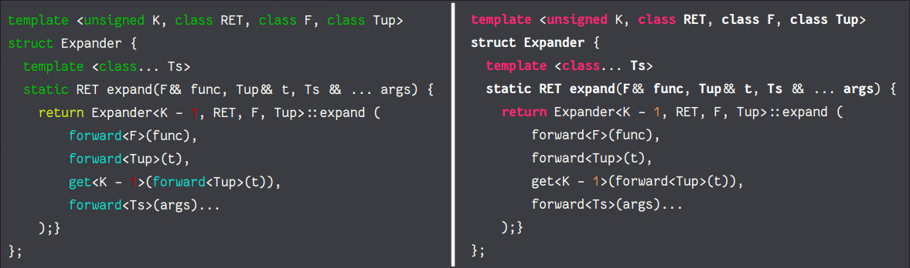

## Introduction

This is a [hexo](https://github.com/hexojs/hexo)
tag plugin which allows you to use vim syntax highlight to highlight code inside markdown.

## Why?
Hexo is a static blogging system written in Node.js, it uses [highlight.js](http://softwaremaniacs.org/soft/highlight/en/)
by default to render code.

However, lots of languages are not supported by highlight.js, but always supported by vim with proper plugins.
Moreover, vim usually supports __more features than highlight.js__, even for common languages.
See the demo below (left: vimhighlight; right: highlight.js).



From the image above, we see that highlight.js cannot recognize C++ keywords "struct", "static";
it also cannot recognize STL functions "forward" and "get". All of these can be handled correctly by vim.

See [this page](http://ppwwyyxx.com/2013/Explode-Tuple-in-C++11/) for more samples.
Note that the actual appearance depends on how you config your vim.

## Installation

You need to have vim properly installed and configured, since this program will directly run vim.

To install, run the following command in the root directory of hexo:
```
npm install hexo-tag-vimhighlight --save
```

And add this plugin in your ``_config.yml``.

## Usage

Specify the code filetype, and whether to show line number, in
the common format of tag plugins:

```

template <unsigned K, class RET, class F, class Tup>
struct Expander {
  template <class... Ts>
  static RET expand(F&& func, Tup&& t, Ts && ... args) {
    return Expander<K - 1, RET, F, Tup>::expand (
        forward<F>(func),
        forward<Tup>(t),
        get<K - 1>(forward<Tup>(t)),
        forward<Ts>(args)...
    );}
};

```

By default, line number will not be displayed, you can use ```` for short.

It runs vim to highlight the code, so site-generation will probably take much longer at
the first time. But then the highlighted code will be cached in ``your_hexo_root/cache/vimHighlight``.
After changing your vim colorscheme, you'll need to remove the cache folder manually.
